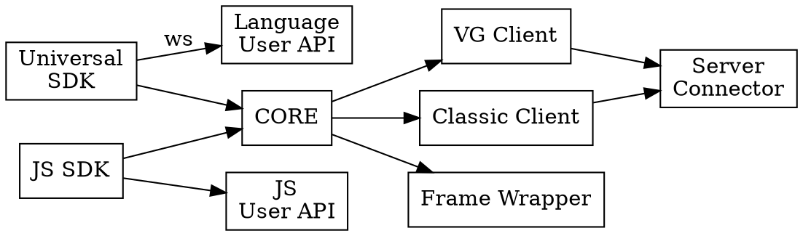

## Problem
Applitools has a bunch of SDKs written in different languages. But all of them are implement the same functionality and the same features. The supporting of that large number of SDKs is a difficult task and it is a cause of many bugs on different SDKs. Instead of consolidating our problem-solving efforts, we are forced to spend a lot of time maintain a huge code base.

## Solution
The JS SDKs are have already solved lots of problems in a way of unification and abstraction of the functionality and specifics of different frameworks. The two waves of refactoring the CORE have made it suitable to abstract even the language specifics.

### Packages



### Network layer
The network layer could be implemented through WebSocket communication or HTTP polling. The implementation requires two-ways communication this is why the WebSocket implementation looks as a superior tech.

#### Consumer abstractions
Not primitive objects which need to be sent to the Universal SDK.
```ts
type Driver = {
  'applitools-driver-id': string, // driver id
}
type Context = {
  'applitools-context-id': string, // context id
}
type Element = {
  'applitools-element-id': string, // element id
}
```

#### SDK abstractions
Not primitive objects which need to be sent to the Universal SDK.
```ts
type Eyes = {
  'applitools-eyes-id': string, // eyes id
}
```

#### Message format
Message should be a string formatted as json string with next structure
```ts
type Message = {
  name: string, // name of the command to perform (e.g. Driver.executeScript or Eyes.open)
  payload: object, // commands payload
}
```

#### Driver commands
<details>
  <summary>Driver.executeScript</summary>

  ```ts
  type RequestObject = {
    contextId: string, // id of the context to execute script in
    script: // script to execute
    args: Array<any>, // an array of arguments which need to be passed to execute script function.
  }

  type ResponseObject = {
    error: string, // message of the error which happened during script execution
    result: any, // the value returned from the script
  }
  ```
</details>

<details>
  <summary>Driver.mainContext</summary>

  ```ts
  type RequestObject = {
    context: Context, // id of the context to return main context for
  }

  type ResponseObject = {
    context: Context, // id of the main context. Might be the same as one passed if context if already main
  }
  ```
</details>

<details>
  <summary>Driver.parentContext</summary>

  ```ts
  type RequestObject = {
    context: Context, // id of the context to return parent context for
  }

  type ResponseObject = {
    context: Context, // id of the parent context. Might be the same as one passed if context is main
  }
  ```
</details>

<details>
  <summary>Driver.childContext</summary>

  ```ts
  type RequestObject = {
    context: Context, // id of the context to return parent context for
    element: Element, // frame element
  }

  type ResponseObject = {
    error: string, // message of the error which happened during executing child context
    context: Context, // id of the child context. Might be the same as one passed if context is main
  }
  ```
</details>

<details>
  <summary>Driver.findElement</summary>

  ```ts
  type RequestObject = {
    context: Context, // id of the context to find an element in
    selector: {
      type: string, // selector type (e.g. css, xpath, etc.)
      selector: string, // selector value
    },
  }

  type ResponseObject = {
    element: string | null, // id of the element or null if element is not found
  }
  ```
</details> 

<details>
  <summary>Driver.findElements</summary>

  ```ts
  type RequestObject = {
    context: Context, // id of the context to find an elements in
    selector: {
      type: string, // selector type (e.g. css, xpath, etc.)
      selector: string, // selector value
    },
  }

  type ResponseObject = {
    elements: Array<Element>, // elements found for specific selector in specific context
  }
  ```
</details>

<details>
  <summary>Driver.getWindowRect</summary>

  ```ts
  type RequestObject = {
    driver: Driver, // driver to get window rect for
  }

  type ResponseObject = {
    rect: {
      x: number, // offset relative to the left edge of the screen
      y: number, // offset relative to the top edge of the screen
      width: number, // width of the window
      height: number, // height of the window
    },
  }
  ```
</details>

<details>
  <summary>Driver.setWindowRect</summary>

  ```ts
  type RequestObject = {
    driver: Driver, // driver to set window rect for
    rect: {
      x: number, // window offset relative to the left edge of the screen
      y: number, // window offset relative to the top edge of the screen
      width: number, // width of the window
      height: number, // height of the window
    },
  }

  type ResponseObject = {}
  ```
</details>

<details>
  <summary>Driver.getViewportSize</summary>

  ```ts
  type RequestObject = {
    driver: Driver, // driver to get viewport size for
  }

  type ResponseObject = {
    size: {
      width: number, // viewport width
      height: number, // viewport height
    },
  }
  ```
</details>

<details>
  <summary>Driver.setViewportSize</summary>

  ```ts
  type RequestObject = {
    driver: Driver, // driver to set viewport size for
    size: {
      width: number, // viewport width
      height: number, // viewport height
    },
  }

  type ResponseObject = {}
  ```
</details>

<details>
  <summary>Driver.getOrientation</summary>

  ```ts
  type RequestObject = {
    driver: Driver, // driver to get orientation of
  }

  type ResponseObject = {
    orientation: 'portrait'|'portrait-upside-down'|'landscape'|'landscape-right'|'landscape-left' // device orientation
  }
  ```
</details>

<details>
  <summary>Driver.getUrl</summary>

  ```ts
  type RequestObject = {
    driver: Driver, // driver to get orientation of
  }

  type ResponseObject = {
    url: string, // url of the current page
  }
  ```
</details>

<details>
  <summary>Driver.getTitle</summary>

  ```ts
  type RequestObject = {
    driver: Driver, // driver to get orientation of
  }

  type ResponseObject = {
    title: string, // title of the current page
  }
  ```
</details>

<details>
  <summary>Driver.getOrientation</summary>

  ```ts
  type RequestObject = {
    driver: Driver, // driver to get orientation of
  }

  type ResponseObject = {
    orientation: 'portrait'|'portrait-upside-down'|'landscape'|'landscape-right'|'landscape-left'
  }
  ```
</details>

<details>
  <summary>Driver.getDriverInfo</summary>

  ```ts
  type RequestObject = {
    driver: Driver, // driver to get information about
  }

  type ResponseObject = {
    info: {
      sessionId?: string, // webdriver session id
      isMobile?: boolean, // true if running on mobile device
      isNative?: boolean, // true if running a native app instead of browser,
      deviceName?: string, // device name if possible to extract
      platformName?: string, // platform name if possible to extract,
      platformVersion?: string, // platform version if possible to extract,
      browserName?: // browser name if possible to extract,
      browserVersion?: // browser version if possible to extract,
    }
  }
  ```
</details>

<details>
  <summary>Driver.takeScreenshot</summary>

  ```ts
  type RequestObject = {
    driver: Driver, // driver to take screenshot of
  }

  type ResponseObject = {
    image: Buffer | ArrayBuffer | string // image data, if sent as a string should be base64 encoded
  }
  ```
</details>

#### Eyes commands
<details>
  <summary>Eyes.new</summary>

  ```ts
  type RequestObject = {
    vg: boolean,
    config: EyesConfiguration,
  }

  type ResponseObject = {
    eyes: Eyes,
  }
  ```
</details>

<details>
  <summary>Eyes.open</summary>

  ```ts
  type RequestObject = {
    driver: Driver,
    config: EyesConfiguration,
  }

  type ResponseObject = {
    eyes: Eyes,
  }
  ```
</details>

<details>
  <summary>Eyes.check</summary>

  ```ts
  type RequestObject = {
    eyes: Eyes,
    checkSettings: CheckSettings,
  }

  type ResponseObject = {}
  ```
</details>

<details>
  <summary>Eyes.close</summary>

  ```ts
  type RequestObject = {
    eyes: Eyes,
  }

  type ResponseObject = {}
  ```
</details>